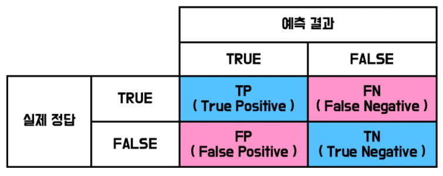
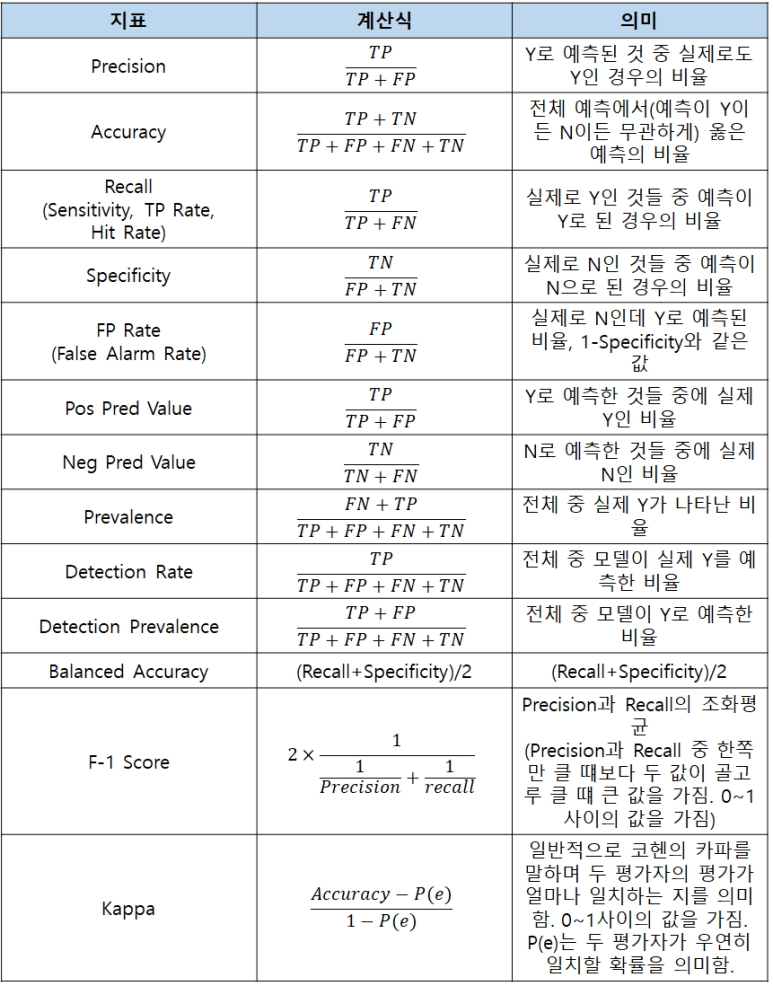

# 0721 

## OpenCV 
- Computer Vision을 위해 만들어진 오픈소스
- 이미지 & 비디오 처리를 위한 라이브러리

https://opencv.org/
https://docs.opencv.org/4.x/index.html

1. 오픈소스라서 누구나 사용이 가능하다
2. 다양한 플랫폼에서 사용이 가능하다
- Python, C++ 주로 사용
3. 이미지 & 비디오 데이터에 대한 다양한 처리 기능을 제공한다
***

# 데이터 정규화 
머신러닝 모델의 성능을 향상시키기 위해 데이터의 범위나 분포를 조정하는 과정

각 변수의 스케일을 동일하게 하거나 특정 범위 내에 맞추어 모델이 특정 변수에 과도하게 의존하지 않도록 한다. 

# 혼동행렬
모델의 성능을 평가할 때 사용되는 지표

