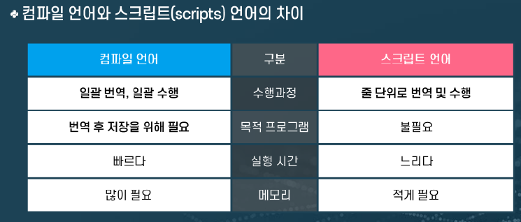

# Python 소개 & 기초문법

기초 문법
1. 주석(comment)
2. 변수(variable)
3. 자료형(data type)
4. 상수와 수식
5. 연산자
***
### 파이썬의 특징 
- 생산성 뛰어남
- 인터프리터 언어
- 라이브러리 풍부
- 다양한 분야에서 활용가능

### 파이썬 활용분여
- 데이터 분석
- 인터넷 프로그래밍 
- DB 프로그래밍 
- 프로토 타입
- 텍스트 프로세싱
- 시스템 유틸리티 
- GUI

***

#### PYTHON 변수 저장 방식
- 자료(Data)가 저장된 주소 저장
- 이 주소를 통해서 데이터를 참조 -> 참조변수
- 예) X변수에 값 3.14159가 저장된 메모리 주소가 저장

#### 자료형 
정수(integer), 실수(floating-point), 문자열(string), 논리형(bool)

1. 수치형 자료형 : 정수 int
    - 소수점이 없는 숫자
    - 기본으로 10진수 
    - 내장함수 int를 활용해 정수 자료형으로 변경이 가능하다 
    - 범위의 제한이 없다

 2. 수치형 자료형 : 실수 float    
     - 소수점 숫자
     - 지수 표현 가능 

3. 문자열 자료형 
    - 문자, 단어 등으로 구성된 문자집합
    - 내장 함수 str()를 활용해 문자열 자료형으로 변경이 가능하다 

    